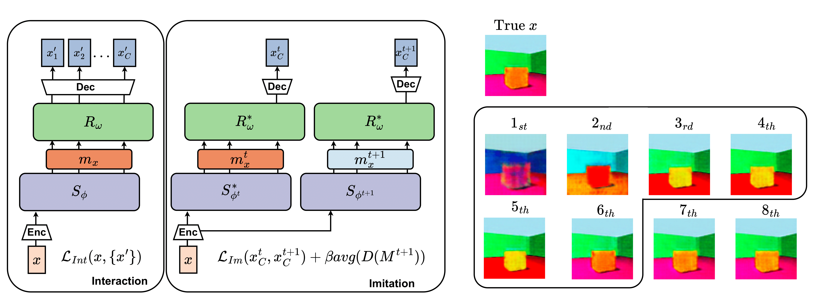

# CELEBI: A Compressive-Expressive Communication Framework for Compositional Generalization
Official PyTorch implementation of  
**“A Compressive-Expressive Communication Framework for Compositional Representations”**  
Rafael Elberg*, Felipe del Rio, Mircea Petrache, Denis Parra  
*NeurIPS 2025 (39th Conference on Neural Information Processing Systems)*  

[[📄 Paper]](https://arxiv.org/abs/2501.19182) | [[🌐 Project Page]](https://github.com/SugarFreeManatee/CELEBI)

---

## 🧠 Overview
CELEBI (**Compressive-Expressive Language Emergence through a discrete Bottleneck and Iterated learning**)  
is a self-supervised framework for **inducing compositional representations** through a **communication game**
between a _sender_ and a _receiver_.  

It extends the **Lewis Reconstruction Game** framework with three key mechanisms:

1. **Progressive Decoding (PD)** – The receiver reconstructs the input after each symbol, promoting efficiency and interpretable intermediate reasoning.  
2. **Final-State Imitation (FiSI)** – During iterated learning, the student reproduces only the final reconstruction of the teacher, enforcing a tighter generational bottleneck.  
3. **Pairwise Distance Maximization (PDM)** – A regularizer that increases message diversity and approximates entropy maximization.

Together, these pressures foster **compositionality**, **efficiency**, and **expressivity** in emergent communication.

<p align="center">
  
</p>

---

## 🚀 Features
- **Emergent Communication** based on the [EGG framework](https://github.com/facebookresearch/EGG)  
- **Iterated Learning Loop** with separate interaction + imitation phases  
- **Progressive Decoding** objective for efficient message use  
- **Final-State Imitation** for compressive transmission  
- **Pairwise Distance Maximization** regularization  
- Evaluation of **compositionality** (TopSim), **efficiency** (useful length ℓ̂ ε), and **expressivity** (MSE)  
- Optional comparison with **β-VAE** and **β-TCVAE** baselines  

---

## 📦 Installation
Clone this repository and install dependencies:
```bash
git clone https://github.com/SugarFreeManatee/CELEBI.git
cd celebi
conda create -n celebi python=3.10
conda activate celebi
pip install -r requirements.txt
